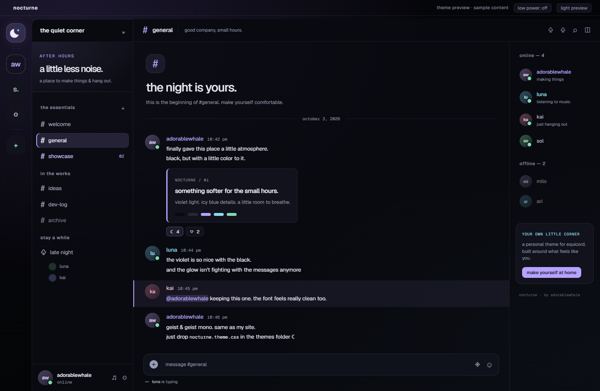
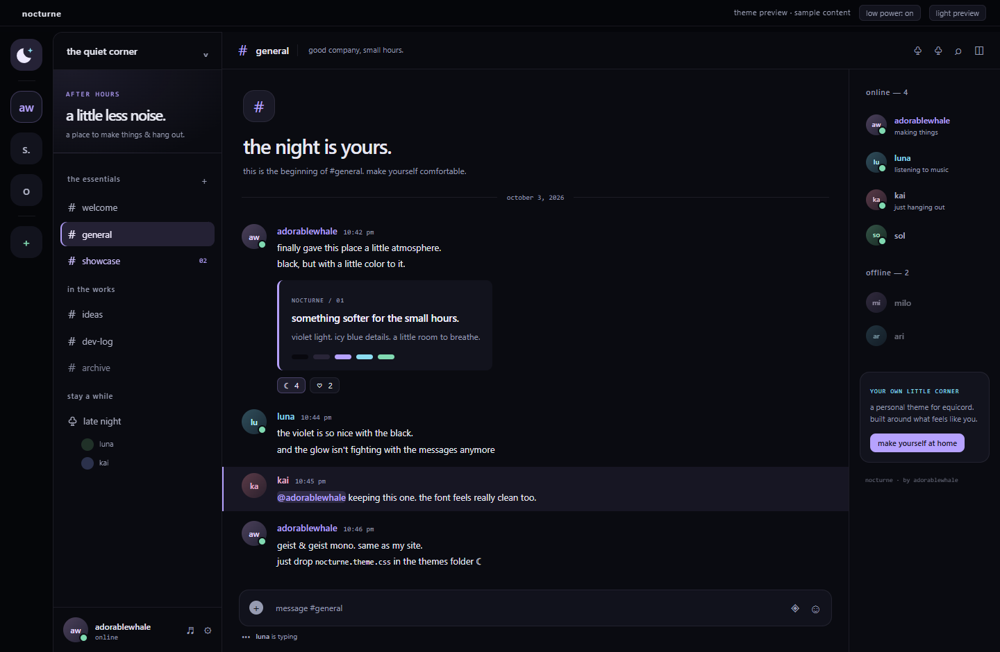

<div align="center">


# nocturne

**a black, violet and ice theme for equicord, with optional low power.**

</div>



### how to use

1. download the [latest release](https://github.com/adorablewhale/nocturne/releases/latest).
2. open Discord settings > equicord > themes > open themes folder. copy the two `.theme.css` files there.
3. enable **nocturne**, disable other full themes, and use dark or onyx appearance.
4. keep the main theme on. toggle **nocturne low power** whenever you want flatter surfaces, system fonts and less rendering work.

for automatic default-theme updates, add this in equicord's online themes:

```text
https://raw.githubusercontent.com/adorablewhale/nocturne/main/nocturne.theme.css
```

### what it does

- **quiet color** - near-black panels, soft violet selection, icy focus, readable buttons.
- **your wallpaper** - open the downloaded `customize.html`, pick colors or a local image, and export your theme. optional background blur stays off by default.
- **low power** - disables wallpaper, background blur, decorative glow and CSS motion. either theme-file order works.
- **self-contained** - embedded Geist fonts and crescent icon; no ClearVision engine or theme scripts.



these previews contain sample messages, a sample banner and a sample welcome screen. they illustrate the palette and surfaces; Discord supplies your actual layout and content.

### customization and performance

local wallpapers stay in your browser, are resized to fit 1920 x 1080 and embedded as static WebP. no upload. replace the local main CSS with the downloaded preset; use the local theme instead of the default online theme for your customization. an image URL loads directly from its host and can cost more memory, especially if huge or animated.

normal mode has no wallpaper or blur by default. the 1.0.0 reduced-motion reload bug is fixed. low power reduces rendering effects; it cannot cap Discord's RAM, stop GIFs/videos or force cached fonts and images out of memory. [actual measurements and verification](PERFORMANCE.md).

### build from source

with Node.js and Google Chrome installed:

```sh
npm install && npm run build && npm test
```

[customization, files and maintenance](MAINTAINING.md). theme/tool code is Apache-2.0; embedded fonts are SIL OFL 1.1. retained [upstream credit](NOTICE).

### something broke?

message me on [discord](https://discord.com/users/599705734002769920), it works way better than issues here. tell me what you were doing and what happened.

---

<div align="center"><sub>🐳 <b>adorablewhale</b> · <a href="https://adorablewhale.world/me">website</a> · <a href="https://discord.com/users/599705734002769920">discord</a> · <a href="https://github.com/adorablewhale">other projects</a></sub></div>
